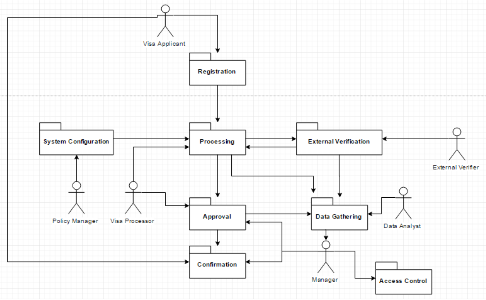
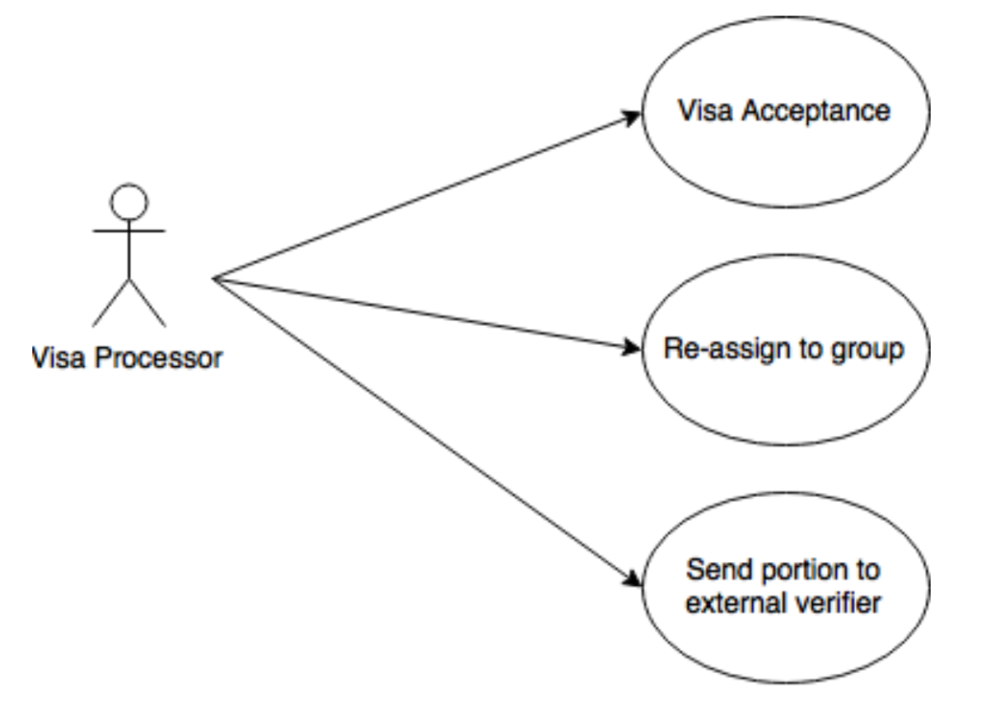
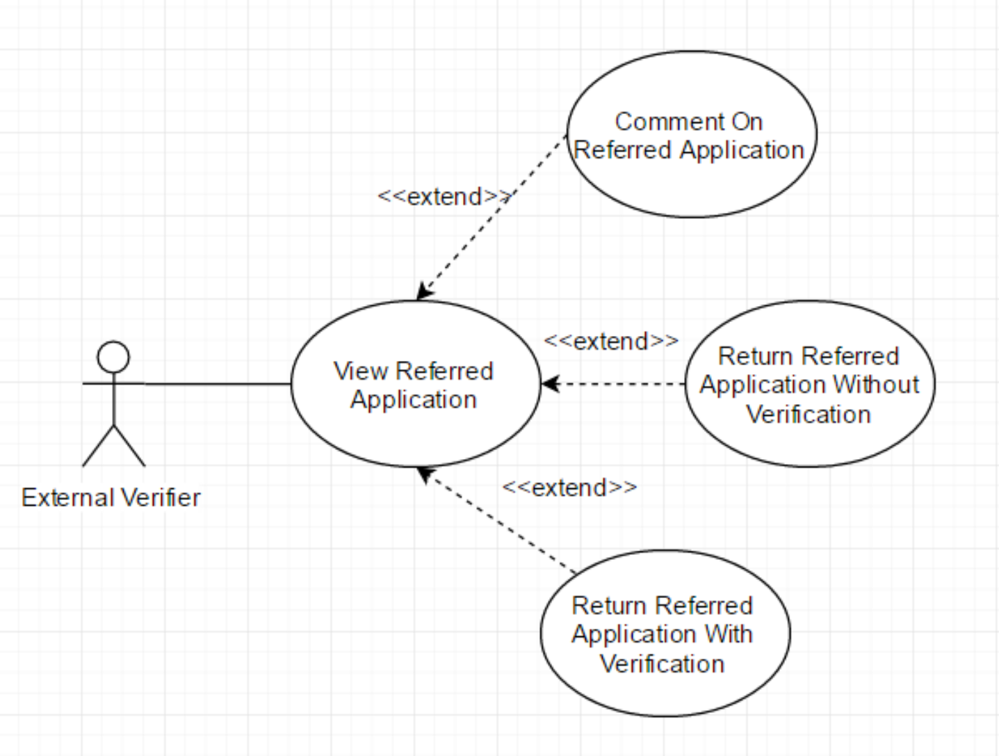
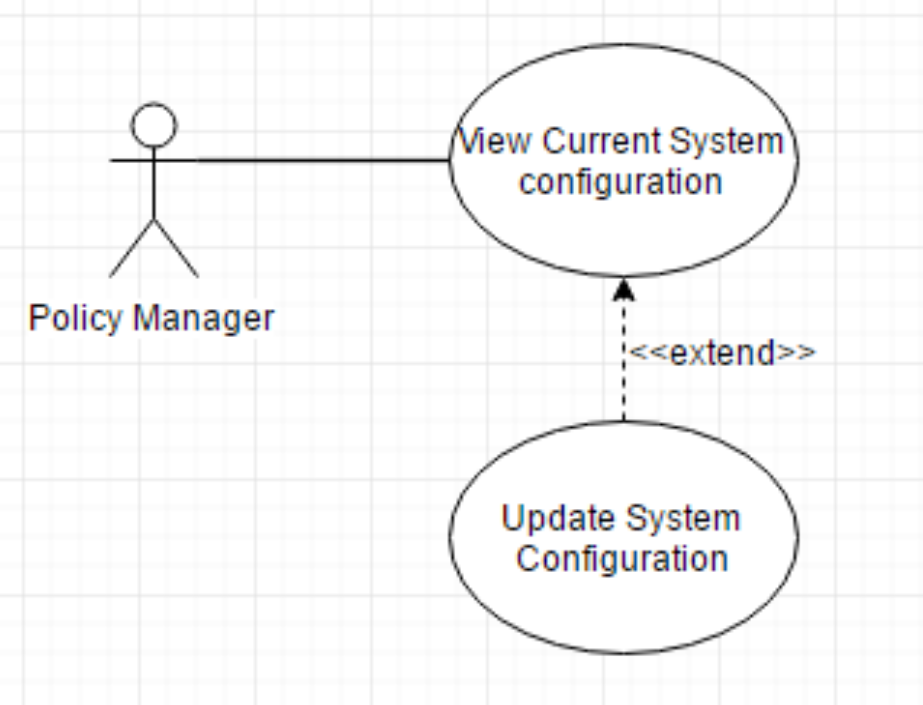
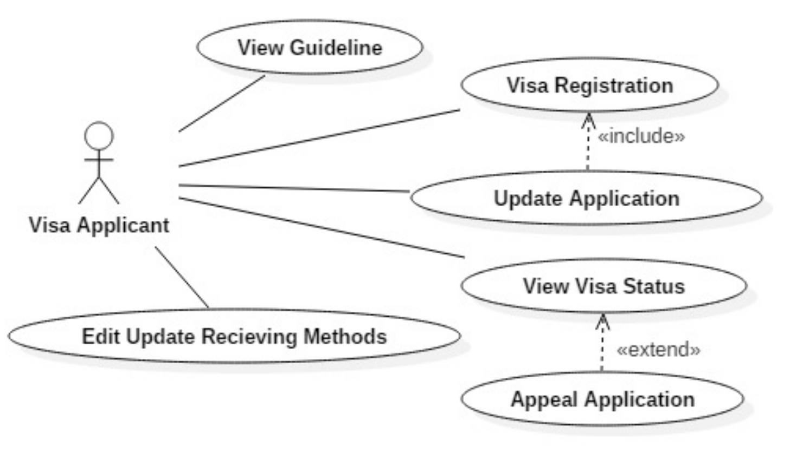
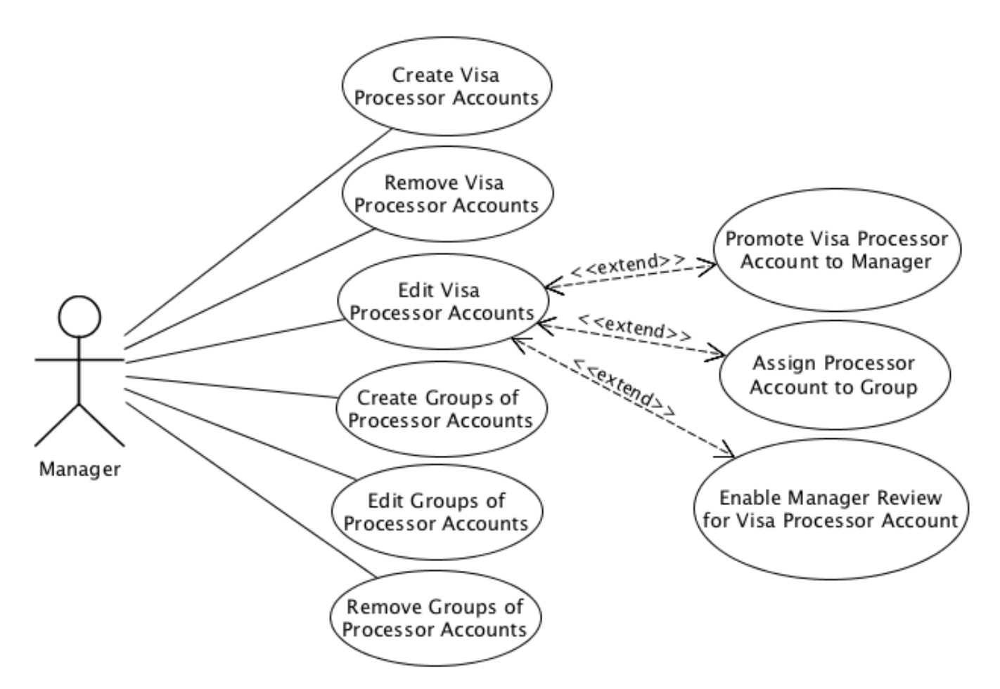
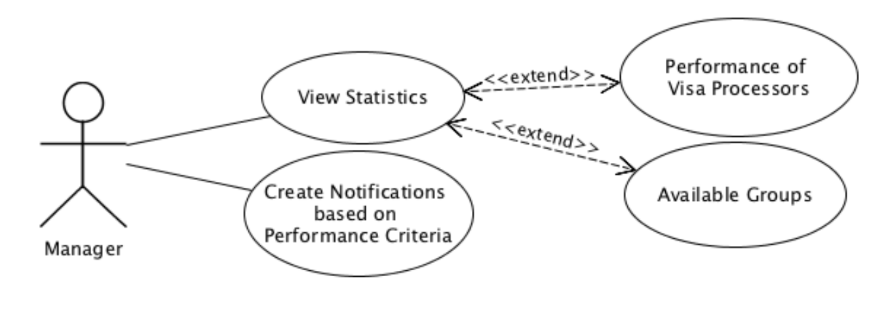
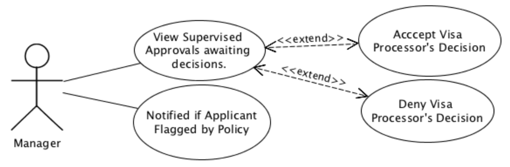

# Introduction
This document provides the requirement specification for an eVisa processing system. This is designed to streamline the application and approval process for foreign citizens seeking to enter Australia.

\newpage
# Use Case Packages
## Package Diagram
{width=100%}

## Package Descriptions
|   **Package Name**    |                                    **Description**                                     |
| --------------------- | -------------------------------------------------------------------------------------- |
| Access Control        | Create and manage users and assign access privileges                                   |
| Registration          | Give personal information to begin application                                         |
| Approval              | The decision of whether or not to grant a visa is made                                 |
| Confirmation          | The applicant is notified whether or not their application was successful              |
| Data Gathering        | View statistics on the behaviour of employees. Allows for more complex data operations |
| External Verification | External verifiers may make comments on an application                                 |
| System Configuration  | Policy rules are updated (e.g. updating a black list etc)                              |

\newpage
# Use Case Diagrams
## Processing
{width=100%}

## External Verification
{width=100%}

## System Configuration
{width=100%}

## Registration
{width=100%}

## Access Control
{width=100%}

## Data Gathering
{width=100%}

## Approval
{width=100%}

\newpage
# Actor Descriptions
\begin{center}
\begin{tabular}{p{3cm}p{11cm}}
\hline\textbf{Actor Name} & \textbf{Description} \\\hline
Visa Processor & Less common user but more frequent and with higher permissions. These users will be reviewing data entered by the Visa Applicant users and approve/deny visas.\\
External Verifier & Users who are not responsible for processing applications, nor under the responsibility of a Manager, but have can have significant information influencing a Visa Processor’s decision. A Visa Processor can refer an application to an External Verifier to receive a recommendation. Examples of External Verifiers are members of the AFP or FBI, medical doctors responsible for examinations, or an employer verifying that the applicant is an employee.\\
Manager & Manages a group of Visa Processors by creating Visa Processor accounts with necessary restrictions and monitors processor actions and performance.\\
Policy Manager & Rare users, responsible for updating system configuration to reflect changes in visa policy. E.g. introducing a new type of visa, changing the list of countries that automatically require extra attention.\\
Visa Applicant & The person who apply visa through the system \\\hline
\end{tabular}
\end{center}

\newpage
# Use Case Summaries
## External Verification
|           **Use Case**            |                                                                            **Summary**                                                                            |
| --------------------------------- | ----------------------------------------------------------------------------------------------------------------------------------------------------------------- |
| Vias Acceptance                   | Allows the user to accept or deny a visa application. The user is also able to write notes or comments and attention them to the application                      |
| Re-assign to Group                | Allows the user to forward a visa application onto another group, in case the user is not qualified or unsure to complete the visa application process            |
| Send portion to external verifier | Gives the user the ability to select different areas of the visa application and forward the detail to an external source, such as the FBI or other organisations |

## External Verification
|                    **Use Case**                     |                                                        **Summary**                                                         |
| --------------------------------------------------- | -------------------------------------------------------------------------------------------------------------------------- |
| View referred application                           | As an external verifier, I can view the parts of an application that have been referred to me                              |
| Comment on referred application                     | As an external verifier, I can add comments and supporting evidence on an application that has been referred to me         |
| Return referred application that cannot be verified | As an external verifier, I can return the application to the referrer if I believe I cannot verify it for whatever reason. |
| Return referred application has been verified       | As an external verifier, I can return the application to the referrer once I have verified it.                             |

## System Configuration
|           **Use Case**            |                       **Summary**                        |
| --------------------------------- | -------------------------------------------------------- |
| View current system configuration | As a policy manager, I can view all current policy rules |
| Update system configuration       | As a policy manager, I can update a policy rule          |

## Registration
|         **Use Case**          |                           **Sumary**                            |
| ----------------------------- | --------------------------------------------------------------- |
| View Guideline                | To view the guideline on which visa to apply and how to apply   |
| Visa Registration             | Application for applicant to fill up for registering a visa     |
| Update Application            | Allow applicant to modify application detail                    |
| View Visa Status              | Allow applicant to view status and details of the visa applied  |
| Appeal Application            | Appeal application to be review again for denied visa applicant |
| Edit Updates Receiving Method | Modify option of receiving visa related updates                 |

## Access Control
|              **Use Case**               |                                                             **Summary**                                                             |
| --------------------------------------- | ----------------------------------------------------------------------------------------------------------------------------------- |
| Create Visa Processor Account           | Allows the manager to create an account for a new Visa Processor                                                                    |
| Remove Visa Processor Account           | Allows the manager to remove an account for a new Visa Processor                                                                    |
| Edit Visa Processor Account Permissions | A Manager should be able to change the permissions of individual Visa Processors                                                    |
| Create Groups of Visa Processors        | A Manager can create groups for Visa Processor accounts based on specializations                                                    |
| Assign Processor Accounts to Groups     | A Manager can add and remove Visa Processor accounts from the groups. A single Visa Processor account can be within multiple groups |

## Data Gathering
|                     **Use Case**                      |                                                                  **Summary**                                                                   |
| ----------------------------------------------------- | ---------------------------------------------------------------------------------------------------------------------------------------------- |
| View Processor Statistics                             | Managers can view the statistics of groups or individual Visa Processor accounts                                                               |
| Create Notification Conditions for Processor Accounts | Allows the Manager to create certain conditions for individual Visa Processor accounts which, if met, will send a notification to that manager |

## Approval
|                   **Use Case**                    |                                                                **Summary**                                                                 |
| ------------------------------------------------- | ------------------------------------------------------------------------------------------------------------------------------------------ |
| Enable Review Requirement for a Processor Account | Managers can enable an individual Visa Processor account's decisions to be reviewed. This can be used for new Processor employees          |
| Promote Processor Account to Manager              | A Manager can promote a Visa Processor account to Manager Level. Once conducted, a demotion can only be conducted by system administrators |

\newpage
# Use Case Descriptions
## Visa Acceptance
\begin{center}
\begin{tabular}{p{2.5cm}p{12cm}}
\textbf{Version} & 0.1\\
\textbf{Date} & 1/4/17\\
\textbf{Package} & Approval\\
\textbf{Summary} & Allows the user to accept or deny a visa application. The user is also able to write notes or comments and attention them to the application\\
\textbf{Primary Actor} & Visa Applicant\\
\textbf{Secondary Actor} & Visa Processor\\
\textbf{Inherits} & \\
\textbf{Includes} & \\
\textbf{Extension Points} & \\
\textbf{Business Rules} & \\
\textbf{Estimate} & \\
\textbf{Pre-Condition(s)} & \\
\textbf{Author} & Daniel Fitzmaurice
\end{tabular}
\end{center}

### Typical Sequence of Events
|                     **Actor Stimulus**                     |                  **System Response**                   |
| ---------------------------------------------------------- | ------------------------------------------------------ |
| 1. Request for Visa Application Document                   | 2. Provides a document ready for viewing               |
| 3. User can accept/deny application or take further action | 4. Visa application is sent elsewhere to be dealt with |

### Alternative Sequences of Events
|                 **Actor Stimulus**                 |                                                  **System Response**                                                   |
| -------------------------------------------------- | ---------------------------------------------------------------------------------------------------------------------- |
| 3. User Reassigns application to a different group | 4. Visa Application is sent to the other group and a person from within that group will accept or deny the application |

: Alternative 1 -- Re-assign Visa at step 3

\newpage
## Re-assign to Group
|   **Version:** 0.1   |                                                                    **Date:** 2/4/17                                                                    |
| -------------------- | ------------------------------------------------------------------------------------------------------------------------------------------------------ |
| **Package**          | Processing                                                                                                                                             |
| **Summary**          | Allows the user to forward a visa application onto another group, in case the user is not qualified or unsure to complete the visa application process |
| **Primary Actor**    | Visa Processor                                                                                                                                         |
| **Secondary Actor**  |                                                                                                                                                        |
| **Inherits**         | Visa Acceptance                                                                                                                                        |
| **Includes**         |                                                                                                                                                        |
| **Extension Points** |                                                                                                                                                        |
| **Business Rules**   |                                                                                                                                                        |
| **Estimate**         |                                                                                                                                                        |
| **Pre-Condition(s)** |                                                                                                                                                        |
| **Author**           | Daniel Fitzmaurice                                                                                                                                                       |

### Typical Sequence of Events
|                 **Actor Stimulus**                  |            **System Response**             |
| --------------------------------------------------- | ------------------------------------------ |
| 1. User submits request for another group to review | 2. User moves application to another group |

### Alternative Sequence of Events
| **Actor Stimulus** |          **System Response**           |
| ------------------ | -------------------------------------- |
|                    | 2.1 The user receives an error message |
|                    | 2.2 No data is changed                 |

: Alternative 1 -- The network transmission fails at step 1

\newpage
## Send portion to external verifier
|   **Version:** 0.1   |                                                                         **Date:** 2/4/17                                                                          |
| -------------------- | ----------------------------------------------------------------------------------------------------------------------------------------------------------------- |
| **Package**          | External Verification                                                                                                                                             |
| **Summary**          | Gives the user the ability to select different areas of the visa application and forward the detail to an external source, such as the FBI or other organisations |
| **Primary Actor**    | Visa Processor                                                                                                                                                    |
| **Secondary Actor**  | External Verifier                                                                                                                                                 |
| **Inherits**         |                                                                                                                                                                   |
| **Includes**         | Provide external verification                                                                                                                                     |
| **Extension Points** |                                                                                                                                                                   |
| **Business Rules**   |                                                                                                                                                                   |
| **Estimate**         |                                                                                                                                                                   |
| **Pre-Condition(s)** |                                                                                                                                                                   |
| **Author**           | Daniel Fitzmaurice                                                                                                                                                                  |

### Typical Sequence of Events
|          **Actor Stimulus**          |                                          **System Response**                                          |
| ------------------------------------ | ----------------------------------------------------------------------------------------------------- |
| 1. User selects data to be forwarded | 2. Packages the information into an exportable format and sends the information to an external source |

\newpage
## View referred application
| **Version:** Initial Version |                                               **Date:** 2/4/17                                               |
| ---------------------------- | ------------------------------------------------------------------------------------------------------------ |
| **Package**                  | External Verification                                                                                        |
| **Summary**                  | As an external verifier, I can view parts of an application that have been referred to me                    |
| **Primary Actor**            | External Verifier                                                                                            |
| **Secondary Actors**         | Visa Processor                                                                                               |
| **Inherits**                 |                                                                                                              |
| **Includes**                 |                                                                                                              |
| **Extension Points**         |                                                                                                              |
| **Business Rules**           | External verifiers can see and comment on only the portion of the application that has been referred to them |
| **Estimate**                 |                                                                                                              |
| **Pre-conditions(s)**        |                                                                                                              |
| **Post-Condition(s)**        | The application has been referred to an external verifier                                                    |
| **Priority**                 | Must Have                                                                                                    |

### Typical Sequence of Events
|                  **Actor Stimulus**                  | **System Response** |
| ---------------------------------------------------- | ------------------- |
| 1. Select the view option for a referred application | 2. The referred portion is displayed                    |

### Alternative Sequences of Events
| **Actor Stimulus** |                     **System Response**                     |
| ------------------ | ----------------------------------------------------------- |
|                    | 2.1 An error message is shown                               |
|                    | 2.2 The external verifier can no longer see the application |

: Alternative 1 -- The external verifier has their access revoked at step 1

| **Actor Stimulus** |                     **System Response**                     |
| ------------------ | ----------------------------------------------------------- |
|                    | 2.1 An error message is shown                               |
|                    | 2.2 The external verifier can no longer see the application |

: Alternative 2 -- The application has already been approved/denied at step 1

\newpage
## Comment on referred application
| **Version:** Initial Version |                                                  **Date:** 2/4/17                                                  |
| ---------------------------- | ------------------------------------------------------------------------------------------------------------------ |
| **Package**                  | External Verification                                                                                              |
| **Summary**                  | As an external verifier, I can add comments and supporting evidence on an application that has been referred to me |
| **Primary Actor**            | External Verifier                                                                                                  |
| **Secondary Actor**          | Visa Processor                                                                                                     |
| **Inherits**                 |                                                                                                                    |
| **Includes**                 |                                                                                                                    |
| **Extension Points**         |                                                                                                                    |
| **Business Rules**           | External verifiers can see and comment on only the portion of the application that has been referred to them       |
| **Estimate**                 |                                                                                                                    |
| **Pre-Condition(s)**         | The application has been viewed by the external verifier                                                           |
| **Post-Condition(s)**        | Any comments made are stored with the application                                                                  |
| **Priority**                 | Must Have                                                                                                                   |

### Typical Sequences of Events
|                   **Actor Stimulus**                   |                      **System Response**                      |
| ------------------------------------------------------ | ------------------------------------------------------------- |
| 1. Enter comments and provide supporting documentation | 2. The comments and documents are stored with the application |

### Alternative Sequences of Events
| **Actor Stimulus** |                     **System Response**                     |
| ------------------ | ----------------------------------------------------------- |
|                    | 2.1 An error message is shown                               |
|                    | 2.2 The external verifier can no longer see the application |

: Alternative 1 -- The external verifier has their access revoked at step 1

| **Actor Stimulus** |                     **System Response**                     |
| ------------------ | ----------------------------------------------------------- |
|                    | 2.1 An error message is shown                               |
|                    | 2.2 The external verifier can no longer see the application |

: Alternative 2 -- The application has already been approved/denied

\newpage
## Return referred application that cannot be verified
| **Version:** Initial Version |                                                        **Date:** 2/4/17                                                        |
| ---------------------------- | ------------------------------------------------------------------------------------------------------------------------------ |
| **Package**                  | External Verification                                                                                                          |
| **Summary**                  | As an external verifier, I can return the application to the referrer if I believe I cannot verify it for whatever reason      |
| **Primary Actor**            | External Verifier                                                                                                              |
| **Secondary Actor**          | Visa Processor                                                                                                                 |
| **Inherits**                 |                                                                                                                                |
| **Includes**                 |                                                                                                                                |
| **Extension Points**         |                                                                                                                                |
| **Business Rules**           | External verifiers can see and comment on only the portion of the application that has been referred to them                   |
| **Estimate**                 |                                                                                                                                |
| **Pre-Condition(s)**         | The application has been referred to an external verifier, and the external verifier believes they cannot provide verification |
| **Post-Condition(s)**        | The application has not been reviewed by an external source                                                                    |
| **Priority**                 | Must Have                                                                                                                      |

### Typical Sequence of Events
|                         **Actor Stimulus**                          |                                        **System Response**                                         |
| ------------------------------------------------------------------- | -------------------------------------------------------------------------------------------------- |
| 1. The verifier selects the cannot verify option on the application | 6.1 The application can no longer be seen by the external verifier                                 |
|                                                                     | 6.2 The Visa Processor who referred the application is notified that the application is unverified |

### Alternative Sequences of Events
| **Actor Stimulus** |                     **System Response**                     |
| ------------------ | ----------------------------------------------------------- |
|                    | 2.1 An error message is shown                               |
|                    | 2.2 The external verifier can no longer see the application |

: Alternative 1 -- The external verifier has their access revoked at step 1

| **Actor Stimulus** |                     **System Response**                     |
| ------------------ | ----------------------------------------------------------- |
|                    | 2.1 An error message is shown                               |
|                    | 2.2 The external verifier can no longer see the application |

: Alternative 2 -- The application has already been approved/denied at step 1

\newpage
## Return referred application that has been verified
| **Version:** Initial Version |                                                          **Date:** 2/4/17                                                          |
| ---------------------------- | ---------------------------------------------------------------------------------------------------------------------------------- |
| **Package**                  | External Verification                                                                                                              |
| **Summary**                  | As an external verifier, I can return the application to the referrer once I have verified it                                      |
| **Primary Actor**            | External Verifier                                                                                                                  |
| **Secondary Actor**          | Visa Processor                                                                                                                     |
| **Inherits**                 |                                                                                                                                    |
| **Includes**                 |                                                                                                                                    |
| **Extension Points**         |                                                                                                                                    |
| **Business Rules**           | External verifiers can see and comment on only the portion of the application that has been referred to them                       |
| **Estimate**                 |                                                                                                                                    |
| **Pre-Condition(s)**         | The application has been referred to an external verifier, and this verifier has provided comments and or supporting documentation |
| **Post-Condition(s)**        | The application has been reviewed by an external source                                                                            |
| **Priority**                 | Must Have                                                                                                                          |

### Typical Sequence of Events
|                   **Actor Stimulus**                   |                               **System Response**                               |
| ------------------------------------------------------ | ------------------------------------------------------------------------------- |
| 5. Select the return option for a referred application | 6.1 The application can no longer be seen by the external verifier              |
|                                                        | 6.2 The Visa Processor who referred the application can proceed with processing |

### Alternative Sequences of Events
| **Actor Stimulus** |                     **System Response**                     |
| ------------------ | ----------------------------------------------------------- |
|                    | 2.1 An error message is shown                               |
|                    | 2.2 The external verifier can no longer see the application |

: Alternative 1 -- The external verifier has their access revoked at step 1

| **Actor Stimulus** |                     **System Response**                     |
| ------------------ | ----------------------------------------------------------- |
|                    | 2.1 An error message is shown                               |
|                    | 2.2 The external verifier can no longer see the application |

: Alternative 2 -- The application has already been approved/denied

\newpage
## View current system configuration
| **Version:** Initial Version |                     **Date:** 2/4/17                     |
| ---------------------------- | -------------------------------------------------------- |
| **Package**                  | System Configuration                                     |
| **Summary**                  | As a policy manager, I can view all current policy rules |
| **Primary Actor**            | Policy Manager                                           |
| **Secondary Actor**          |                                                          |
| **Inherits**                 |                                                          |
| **Includes**                 |                                                          |
| **Extension Points**         |                                                          |
| **Business Rules**           |                                                          |
| **Estimate**                 |                                                          |
| **Pre-Condition(s)**         |                                                          |
| **Post-Condition(s)**        | No changes to configuration have occurred                |
| **Priority**                 | Must Have                                                |

### Typical Sequence of Events
|           **Actor Stimulus**           |              **System Response**               |
| -------------------------------------- | ---------------------------------------------- |
| 1. Select the view policy rules option | 2. A list of all current policies is displayed |

### Alternative Sequences of Events
| **Actor Stimulus** |      **System Response**      |
| ------------------ | ----------------------------- |
|                    | 2.1 An error message is shown |

: Alternative 1 -- The policy manager has their access revoked at step 1

| **Actor Stimulus** |        **System Response**        |
| ------------------ | --------------------------------- |
|                    | 2.1 A notification is shown       |
|                    | 2.2 The displayed data is updated |

: Alternative 2 -- A concurrent modification has occurred at step 1

\newpage
## Update policy rules
| **Version:** Initial Version |                               **Date:** 2/4/17                               |
| ---------------------------- | ---------------------------------------------------------------------------- |
| **Package**                  | System Configuration                                                         |
| **Summary**                  | As a policy manager, I can update the policy rule                            |
| **Primary Actor**            | Policy manager                                                               |
| **Secondary Actor**          |                                                                              |
| **Inherits**                 |                                                                              |
| **Includes**                 |                                                                              |
| **Extension Points**         |                                                                              |
| **Business Rules**           |                                                                              |
| **Estimate**                 |                                                                              |
| **Pre-Condition(s)**         | The policy manager is viewing the list of policy rules                       |
| **Post-Condition(s)**        | The selected policy rule is changed system wide, no other data changes occur |
| **Priority**                 | Must Have                                                                    |

### Typical Sequence of Events
|      **Actor Stimulus**      |        **System Response**         |
| ---------------------------- | ---------------------------------- |
| 1. Select an individual rule | 2. The rule becomes editable       |
| 3. Enter new value           | 4. The new value is displayed      |
| 5. Submit                    | 6. The rule is changed system-wide |

### Alternative Sequences of Events
| **Actor Stimulus** |      **System Response**      |
| ------------------ | ----------------------------- |
|                    | 2.1 An error message is shown |

: Alternative 1 -- The policy manager has their access revoked at step 1

| **Actor Stimulus** |        **System Response**        |
| ------------------ | --------------------------------- |
|                    | 2.1 A notification is shown       |
|                    | 2.2 The displayed data is updated |

: Alternative 2 -- A concurrent modification has occurred

\newpage
## Registration -- View Guideline
| **Version:** Initial Version |                        **Date:** 2/4/17                        |
| ---------------------------- | -------------------------------------------------------------- |
| **Package**                  | View Guideline                                                 |
| **Summary**                  | View the guideline on which visa to apply and how to apply     |
| **Primary Actor**            | Visa Applicant                                                 |
| **Secondary Actor**          |                                                                |
| **Inherits**                 |                                                                |
| **Includes**                 |                                                                |
| **Extension Points**         |                                                                |
| **Business Rules**           |                                                                |
| **Estimate**                 |                                                                |
| **Pre-Condition(s)**         | Guideline needed to exist to be view                           |
| **Post-Condition(s)**        | The guideline information is provided to be the Visa Applicant |
| **Priority**                 | Must Have                                                      |
| **Author**                   | Wei Qing Chin                                                  |

### Typical Sequence of Events
|            **Actor Stimulus**            |       **System Response**       |
| ---------------------------------------- | ------------------------------- |
| 1. Visa Applicant want to view guideline | 2. Display available guidelines |

\newpage
## Registration -- Visa Registration
| **Version:** Initial Version |                                    **Date:** 2/4/17                                    |
| ---------------------------- | -------------------------------------------------------------------------------------- |
| **Package**                  | Registration                                                                           |
| **Summary**                  | Register visa through application                                                      |
| **Primary Actor**            | Visa applicant                                                                         |
| **Secondary Actor**          |                                                                                        |
| **Inherits**                 |                                                                                        |
| **Includes**                 | \<\<Update Application\>\>                                                             |
| **Extension Points**         |                                                                                        |
| **Estimate**                 |                                                                                        |
| **Pre-Condition(s)**         | The Visa Applicants have been successfully registered in the system.                   |
| **Post-Condition(s)**        | The Visa Applicants completed the application and successfully registered for the visa |
| **Priority**                 | Must Have                                                                              |
| **Author**                   | Wei Qing Chin                                                                          |

### Typical Sequence of Events
|           **Actor Stimulus**            |                                 **System Reponse**                                 |
| --------------------------------------- | ---------------------------------------------------------------------------------- |
| 1. Visa Applicant want to register visa | 2.1 System create and display the visa application                                 |
|                                         | 2.2 System record applicant input and upload (extension point: Update Application) |
|                                         | 2.3 Update and submit visa application                                             |

### Alternative Sequences of Events
| **Actor Stimulus** |                **System Response**                 |
| ------------------ | -------------------------------------------------- |
|                    | 2.1 Update all input and upload before it's closed |
|                    | 2.2 Application is not yet submitted               |

\newpage
## Registration -- Update Application
| **Version:** Initial Version |                                                   **Date:** 2/4/17                                                    |
| ---------------------------- | --------------------------------------------------------------------------------------------------------------------- |
| **Package**                  | Registration                                                                                                          |
| **Summary**                  | Allow applicant to modify application detail                                                                          |
| **Primary Actor**            | Visa applicant                                                                                                        |
| **Secondary Actor**          |                                                                                                                       |
| **Inherits**                 |                                                                                                                       |
| **Includes**                 |                                                                                                                       |
| **Extension Points**         |                                                                                                                       |
| **Business Rules**           |                                                                                                                       |
| **Estimate**                 |                                                                                                                       |
| **Pre-Condition(s)**         | The Visa Applicants have been successfully registered in the system. The Visa Applicants have an existing application |
| **Post-Condition(s)**        | Visa Application is updated                                                                                           |
| **Priority**                 | Must Have                                                                                                             |
| **Author**                   | Wei Qing Chin                                                                                                                      |

### Typical Sequence of Events
|                **Actor Stimulus**                |                    **System Response**                    |
| ------------------------------------------------ | --------------------------------------------------------- |
| 1. Visa Applicant want to update personal detail | 2.1 Retrieve and display applicant's existing application |
|                                                  | 2.2 Record applicant input and upload                     |
|                                                  | 2.3 Update and submit visa application                    |

### Alternative Sequences of Events
| **Actor Stimulus** |                     **System Response**                      |
| ------------------ | ------------------------------------------------------------ |
|                    | 2. Applicant recorded personal details remain same as before |

: Alternative 1 -- Visa Applicant do not update personal detail at step 1

| **Actor Stimulus** |                **System Response**                 |
| ------------------ | -------------------------------------------------- |
|                    | 2.1 Update all input and upload before it's closed |
|                    | 2.2 Applicationn is not yet submitted              |

: Alternative 2 -- Visa Applicant close the system without submitting at step 1

\newpage
## Registration -- View Visa Status
| **Version:** Initial Version |                                                                 **Date:** 2/4/17                                                                  |
| ---------------------------- | ------------------------------------------------------------------------------------------------------------------------------------------------- |
| **Package**                  | Registration                                                                                                                                      |
| **Summary**                  | Allow applicant to view status of the visa applied                                                                                                |
| **Primary Actor**            | Visa Applicant                                                                                                                                    |
| **Secondary Actor**          |                                                                                                                                                   |
| **Inherits**                 |                                                                                                                                                   |
| **Includes**                 |                                                                                                                                                   |
| **Extension Points**         | \<\<Appeal Application\>\>                                                                                                                        |
| **Business Rules**           |                                                                                                                                                   |
| **Estimate**                 |                                                                                                                                                   |
| **Pre-Condition(s)**         | The Visa Applicants have been successfully registered in the system. The Visa Applicant's application has been successfully applied in the system |
| **Post-Condition(s)**        | The Visa Application status is provided to the Visa Applicant                                                                                     |
| **Priority**                 | Must Have                                                                                                                                         |
| **Author**                   | Wei Qing Chin                                                                                                                                     |

### Typical Sequence of Events
|                **Actor Stimulus**                 |                                  **System Response**                                  |
| ------------------------------------------------- | ------------------------------------------------------------------------------------- |
| 1. Visa Applicant want to view application status | 2.1 Check for applicant's visa application status                                     |
|                                                   | 2.2 Display applicant's visa application status (extension point: Appeal Application) |

### Alternative Sequences of Events
| **Actor Stimulus** |               **System Response**               |
| ------------------ | ----------------------------------------------- |
|                    | 2.1 System display "Visa Denied"                |
|                    | 2.2 System display reason of why visa is denied |

: Alternative 1 -- Visa applicant's visa was denied at step 1

\newpage
## Registration -- Appeal Application
| **Version:** Initial Version |                                                                                              **Date:** 2/4/17                                                                                               |
| ---------------------------- | ----------------------------------------------------------------------------------------------------------------------------------------------------------------------------------------------------------- |
| **Package**                  | Registration                                                                                                                                                                                                |
| **Summary**                  | Appeal application to be reviewed again for denied visa applicant                                                                                                                                           |
| **Primary Actor**            | Visa applicant                                                                                                                                                                                              |
| **Secondary Actor**          |                                                                                                                                                                                                             |
| **Inherits**                 |                                                                                                                                                                                                             |
| **Includes**                 |                                                                                                                                                                                                             |
| **Extension Points**         |                                                                                                                                                                                                             |
| **Business Rules**           |                                                                                                                                                                                                             |
| **Estimate**                 |                                                                                                                                                                                                             |
| **Pre-Condition(s)**         | The Visa Applicants have been successfully registered in the system. The Visa Applicant's application has been successfully applied in the system. The Visa Applicant's application was reviewed and denied |
| **Post-Condition(s)**        | The Visa Application is resubmitted to be appealed                                                                                                                                                          |
| **Priority**                 | Must Have                                                                                                                                                                                                   |
| **Author**                   | Wei Qing Chin                                                                                                                                                                                               |

### Typical Sequence of Events
|                      **Actor Stimulus**                      |                     **System Response**                      |
| ------------------------------------------------------------ | ------------------------------------------------------------ |
| 1. Visa Applicant wants the denied visa to be reviewed again | 2.1 Check for applicant's visa appeal possibility            |
|                                                              | 2.2 Update and submit applicant's application to be appealed |
|                                                              | 2.3 Change application status                                |

### Alternative Sequences of Events
| **Actor Stimulus** |              **System Response**               |
| ------------------ | ---------------------------------------------- |
|                    | 2.1 System display why visa cannot be appealed |

: Alternative 1 -- Visa applicant's application cannot be appealed at step 1

\newpage
## Registration -- Edit Update Recieving Methods
| **Version:** Initial Version |                          **Date:** 2/4/17                           |
| ---------------------------- | ------------------------------------------------------------------- |
| **Package**                  | Registration                                                        |
| **Summary**                  | Modify option of receiving visa related updates                     |
| **Primary Actor**            | Visa applicant                                                      |
| **Secondary Actor**          |                                                                     |
| **Inherits**                 |                                                                     |
| **Includes**                 |                                                                     |
| **Extension Points**         |                                                                     |
| **Business Rules**           |                                                                     |
| **Estimate**                 |                                                                     |
| **Pre-Condition(s)**         | The Visa Applicants have been successfully registered in the system |
| **Post-Condition(s)**        | The Visa Applications choice of receiving update is updated         |
| **Priority**                 | Must Have                                                           |
| **Author**                   | Wei Qing Chin                                                       |

### Typical Sequence of Events
|                       **Actor Stimulus**                       |                     **System Response**                      |
| -------------------------------------------------------------- | ------------------------------------------------------------ |
| 1. Visa Applicant wants to change way of receiving the updates | 2.1 Check for applicant's current option of receiving update |
|                                                                | 2.2 Record applicants input                                  |
|                                                                | 2.3 Update and save applicant input                          |

### Alternative Sequences of Events
| **Actor Stimulus** |                      **System Response**                      |
| ------------------ | ------------------------------------------------------------- |
|                    | 2.1 System display warning message                            |
|                    | 2.2 System could not proceed until applicant chosen an option |

: Alternative 1 -- Visa applicant did not choose any way of receiving update

\newpage
## Create Visa Processor Accounts
| **Version:** Initial Version |                                **Date:** 2/4/17                                 |
| ---------------------------- | ------------------------------------------------------------------------------- |
| **Package**                  | Access Control                                                                  |
| **Summary**                  | Create new uniquely identifiable accounts for Visa Processors                   |
| **Primary Actor**            | Manager                                                                         |
| **Secondary Actor**          |                                                                                 |
| **Inherits**                 |                                                                                 |
| **Includes**                 |                                                                                 |
| **Extension Points**         |                                                                                 |
| **Business Rules**           |                                                                                 |
| **Estimate**                 |                                                                                 |
| **Pre-Condition(s)**         |                                                                                 |
| **Post-Condition(s)**        | The account has been created and is accessible by the designated Visa Processor |
| **Priority**                 | Must Have                                                                       |
| **Author**                   | Mark Belonogoff                                                                 |

### Typical Sequence of Events
|             **Actor Stimulus**             |                   **System Response**                   |
| ------------------------------------------ | ------------------------------------------------------- |
| 1. Click "Create Processor Account" button | 2. Opens "new processor account form"                   |
| 3. Fill out the new processor account form | 4. Indicate if required fields have not been filled out |
| 5. Submit "new processor account form"     | 6.1 Indicates if form was submitted successfully or not |
|                                            | 6.2 Provides information on how new user can access     |

### Alternative Sequences of Events
| **Actor Stimulus** |                                              **System Response**                                               |
| ------------------ | -------------------------------------------------------------------------------------------------------------- |
|                    | 3.1 Provide error message with reason why account could not be created                                         |
|                    | 3.2 Provide possible solution method for manager (e.g. Retry, contact system administrator with error message) |

: Alternative 1 -- System is unable to create an account at step 3

\newpage
## Remove Visa Processor Accounts
| **Version:** Initial Version |                                                                        **Date:** 2/4/17                                                                        |
| ---------------------------- | -------------------------------------------------------------------------------------------------------------------------------------------------------------- |
| **Package**                  | Access Control                                                                                                                                                 |
| **Summary**                  | A manager can remove a visa processor account                                                                                                                  |
| **Primary Actor**            | Policy Manager                                                                                                                                                 |
| **Seconday Actor**           |                                                                                                                                                                |
| **Inherits**                 |                                                                                                                                                                |
| **Includes**                 |                                                                                                                                                                |
| **Extension Points**         |                                                                                                                                                                |
| **Business Rules**           |                                                                                                                                                                |
| **Estimate**                 |                                                                                                                                                                |
| **Pre-Condition(s)**         | The Processor account must have been created                                                                                                                   |
| **Post-Condition(s)**        | The account has been removed and can no longer be used for the system. All unprocessed applications associated with the account are designated as "unassigned" |
| **Priority**                 | Must Have                                                                                                                                                      |

### Typical Sequence of Events
|                       **Actor Stimulus**                       |                        **System Response**                         |
| -------------------------------------------------------------- | ------------------------------------------------------------------ |
| 1. Click "delete account" for the particular Processor Account | 2. Display a confirmation window                                   |
| 3. Accept confirmation for deletion                            | 4.1 Remove the Processor Account from groups                       |
|                                                                | 4.2 Unassign all unfinished applications from the account          |
|                                                                | 4.3 Display a reponse indicating that the account has been removed |

### Alternative Sequences of Events
| **Actor Stimulus** |                            **System Response**                             |
| ------------------ | -------------------------------------------------------------------------- |
|                    | 3.1 Display response indicating that the Processor account was not deleted |

: Alternative 1 -- The Manager declines the confirmation at step 3

| **Action Stimulus** |                                              **System Response**                                               |
| ------------------- | -------------------------------------------------------------------------------------------------------------- |
|                     | 4.1 Provide error message with reason why account could not be removed                                         |
|                     | 4.2 Provide possible solution method for manager (e.g. Retry, contact system administrator with error message) |

: Alternative 2 -- The system is unable to remove the account at step 4

\newpage
## Edit Visa Processor Accounts
| **Version:** Initial Version |                                **Date:** 2/4/17                                 |
| ---------------------------- | ------------------------------------------------------------------------------- |
| **Package**                  | Access Control                                                                  |
| **Summary**                  | Edit management options for a Visa Processor account supervised by a manager    |
| **Primary Actor**            | Manager                                                                         |
| **Secondary Actor**          |                                                                                 |
| **Inherits**                 |                                                                                 |
| **Includes**                 |                                                                                 |
| **Extension Points**         |                                                                                 |
| **Business Rules**           |                                                                                 |
| **Estimate**                 |                                                                                 |
| **Pre-Condition(s)**         |                                                                                 |
| **Post-Condition(s)**        | The account has been created and is accessible by the designated Visa Processor |
| **Priority**                 | Must Have                                                                       |

### Typical Sequence of Events
|         **Actor Stimulus**          |                   **System Response**                   |
| ----------------------------------- | ------------------------------------------------------- |
| 1. Select Processor account to edit | 2. Provide edit options for account to manager as form  |
| 3. Submit the new options form      | 4.1 Indicates if form was submitted successfully or not |
|                                     | 4.2 Updates groups to show that options have changed    |

### Alternative Sequences of Events
| **Actor Stimulus** |                                              **System Response**                                               |
| ------------------ | -------------------------------------------------------------------------------------------------------------- |
|                    | 4.1 Provide error message with reason why account options could not be updated                                 |
|                    | 4.2 Provide possible solution method for manager (e.g. Retry, contact system administrator with error message) |

: Alternative 1 -- The system is unable to remove the account at step 4

\newpage
# Activity Diagrams
## External Verification
\uml(ADExternalVerification {width=75%})(Provide External Verification)
~~~
@startuml

(*) --> "Retrieve list of available applications"
--> "Select an application"
if "Can verification be provided?" then
    if "Check for available data" then
        --> [Data Available] "Add Comments" as A1
        --> "Add Supporting Documentation"
        --> "Return  with verification"
        --> (*)
    else
        --> [Data Unavailable] "Gather Data"
        --> A1
    endif
else
    --> [No] "Return without verification"
    --> (*)
endif

@enduml
~~~

## Visa Applicant
\uml(ADVisaApplicant {width=100%})(Visa Applicant)
~~~
@startuml

(*) --> ===B1===

===B1=== --> "View Guideline"
===B1=== --> "New application"
--> "Fill up personal detail" as A1
--> "Upload required document"
--> "Submit application"
--> "View Application Status" as A2

if "" then
    -->[approved] (*)
else
    -->[denied] "Appeal Application"
    --> (*)
endif

===B1=== --> "Update application"
--> A1
===B1=== --> A2

@enduml
~~~

## Create Visa Processor Account
\uml(ADCreateVisa {width=100%})(Create Visa Processor Account)
~~~
@startuml

(*) --> "Click 'Create Processor' Button"
--> "Fill in Processor's Details in Form"
--> "Submit Form" as A1
if "All Required Details Filled in?" then
    --> ===B1===
    ===B1=== -->[Account Created] "Dismiss Message that Email Sent to Processor"
    --> (*)
    ===B1=== -->[Account Not Created] "Contact System Administrator with Error"
    --> (*)
else
    -->[No] "Fill in Highlighted Fields"
    --> A1
endif

@enduml
~~~

## Remove Visa Processor Account
\uml(ADRemoveVisa {width=100%})(Remove Visa Processor Account)
~~~
@startuml

(*) --> "Click 'Remove' Button for Processor"
if "" then
    -->[Account Removed] "Dismiss Message that Processor Removed"
    --> (*)
else
    -->[Account Not Removed] "Contact System Administrator with Error"
    --> (*)
endif

@enduml
~~~

## Edit Visa Processor Account
\uml(ADEditVisa {width=100%})(Edit Visa Processor Account)
~~~
@startuml

(*) --> "Click 'Edit' Button for Processor Account"
--> "Update the Processor Account Options Form"
--> "Submit Form" as A1
if "All Options are Valid?" then
    if "" then
        --> [Account Updated] "Dismiss Message that Processor Account Updated"
        --> (*)
    else
        --> [Account Not Updated] "Contact System Administrator with Error"
        --> (*)
    endif
else
    -up->[No] "Edit the Highlighted Fields"
    --> A1
endif

@enduml
~~~
